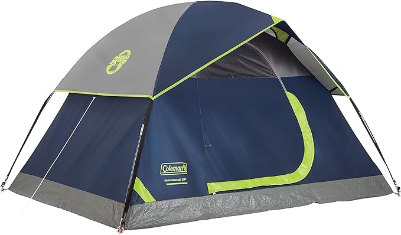
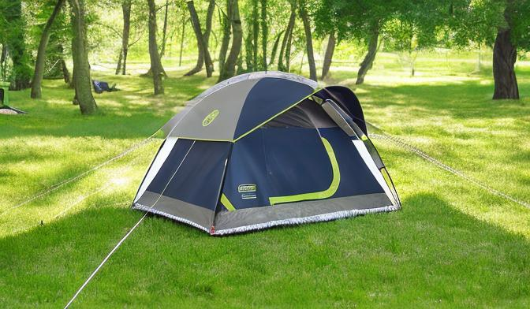

# Product Scene Generator

This project is designed to generate a visually appealing scene for e-commerce products using an input image and a descriptive prompt. It removes the background from the product image, creates a canvas for scene generation, creates a mask, and finally produces an image and a video showcasing the product in the text-conditioned scene using Stable Diffusion. 

## How to Use

### Step 1: Install Requirements

Make sure you have all the required libraries installed. You can do this by running:

```bash
pip install -r requirements.txt
```

### Step 2: Run the Pipeline

To run the pipeline, use the following command:

```bash
python run.py --image Examples/tent.jpg --text-prompt "Camping tent in a green lawn."
```

## Example Result

### Input Image


### Text Prompt
*"Camping tent in a green lawn."*

### Scene


### Video


You can view other generations in the [Results](Results) folder.
